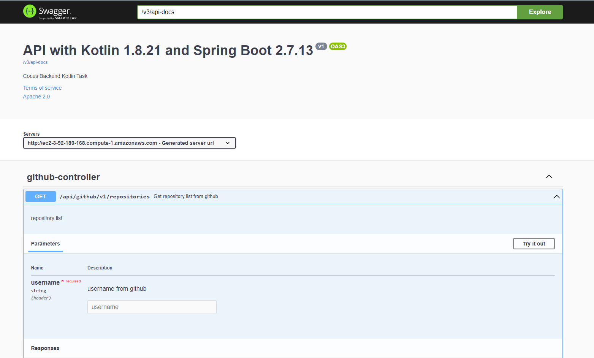

# API Github - Backend task Cocus
(Kotlin Developer backend)

[](https://github.com/joaorobertopereira/api-github/actions/workflows/continuous_integration.yml)
[](https://hub.docker.com/repository/docker/joaoroberto/api-github)

# Getting Started
The purpose of the API is to return a list of GitHub repositories that are not of the fork type and are public, ie repositories that were created by the github user. How it works is quite simple, just enter the github user code and the API will return the list of repositories.

The api was developed using the kotlin programming language, where we use the spring framework. 
We build the reactive API, where we have a non-blocking http client. The http client was implemented using coroutine. 
We use OpenApi to generate the Swagger code and documentation using SpringDoc.

### Reference Documentation
For further reference, please consider the following sections:

[Kotlin Coroutines] (https://kotlinlang.org/docs/coroutines-overview.html)
[SpringBoot Reactive] (https://spring.io/reactive)

### Run Application

Local:
<code>
    docker-compose up -d
</code>

### Response
```json
{
    "repositories": [
      {
        "name": "api-github",
        "login": "joaorobertopereira",
        "branches": [
            {
              "name": "develop",
              "commit": {
                "sha": "6b993dcdb8a6fc3c4f9fbd53960fce30ae802aab"
              }
            },
            {
              "name": "main",
              "commit": {
                "sha": "8ddadc124081dfd1ab855dbcee728d6a0116277a"
              }
            }
          ]
      },
      {
        "name": "api-ibm-cloud",
        "login": "joaorobertopereira",
        "branches": [
            {
              "name": "main",
              "commit": {
              "sha": "2297fa719f99879b68a0d3a87bb20d48db00854e"
            }
          }
        ]
      }    
    ]
}
```


### Swagger
Url Swagger Local: http://localhost/webjars/swagger-ui/index.html
AWS URL: http://ec2-3-92-180-168.compute-1.amazonaws.com/webjars/swagger-ui/index.html



    

